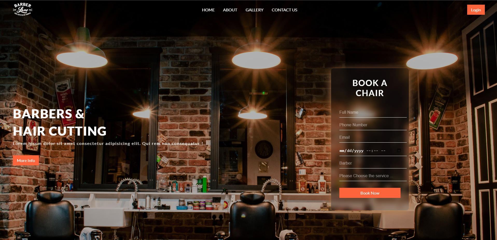
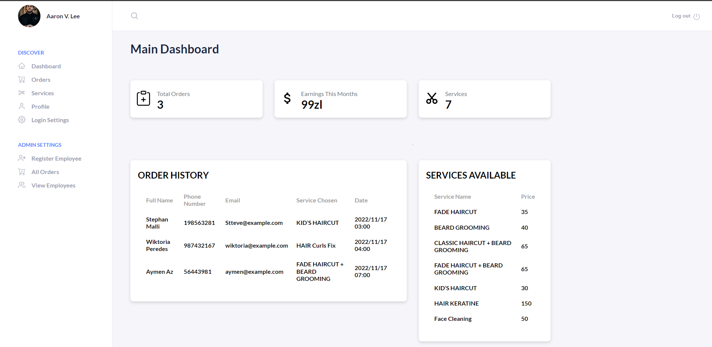
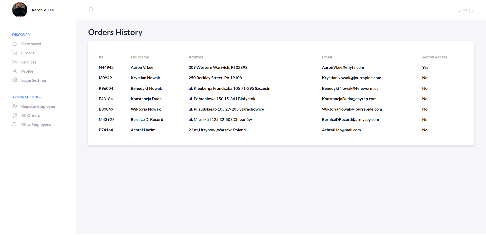
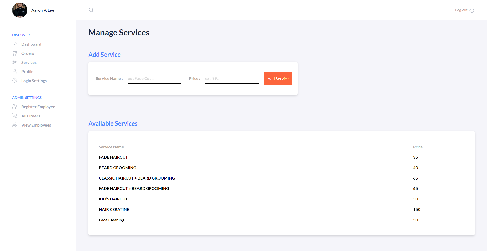
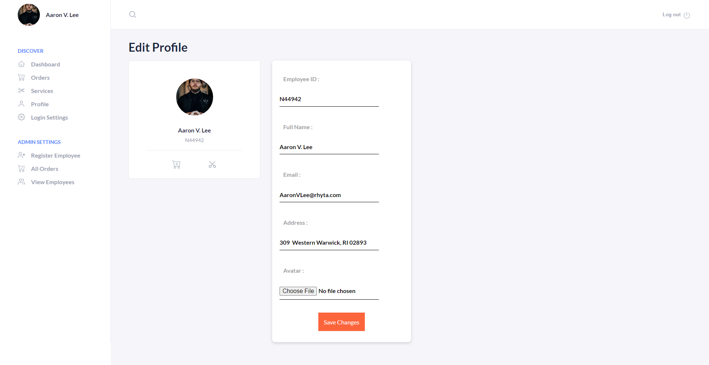
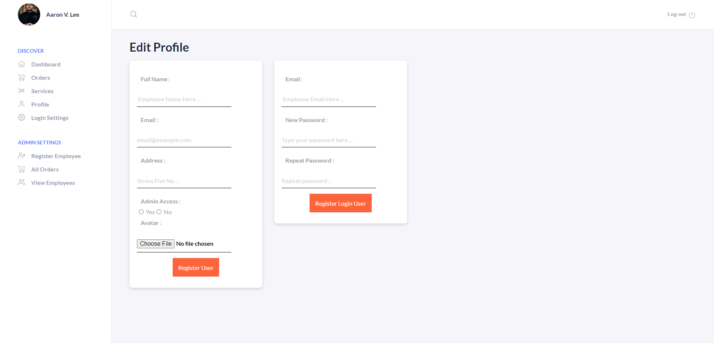

# BookMeBarber

A web application that allows you to book a barber appointment as a client , and to to manage them and other things an Employee or Admin

## Table of contents

- [Overview](#overview)
  - [The challenge](#the-challenge)
  - [Screenshot](#screenshot)
  - [Links](#links)
- [My process](#my-process)
  - [Built with](#built-with)
- [Author](#author)

## Overview

### The challenge

Client should be able to:

- Book Appointment

Employee should be able to:

- Add a new Service
- Check the appointments that are available for him
- Edit his profile and login settings

Admin should be able to:

- Check all the appointments
- Register a new employee
- Edit his profile and login settings
- Check Employees List
- Reset EmployeeLogin by creating a new password

### Screenshot

More Screenshots are available in the Screenshots folder

### Links

- Solution URL: [Click Me !](https://github.com/aymendev1/BookMeBarber-App)

### Built with

- ReactJS
- NODEJS
- ExpressJS
- REST API
- MongoDB ...

## Author

- Website - [Aymen's Portfolio](https://www.aymendev1.com)
- LinkedIn- [@aymanazougar](https://www.linkedin.com/in/aymanazougar/)
